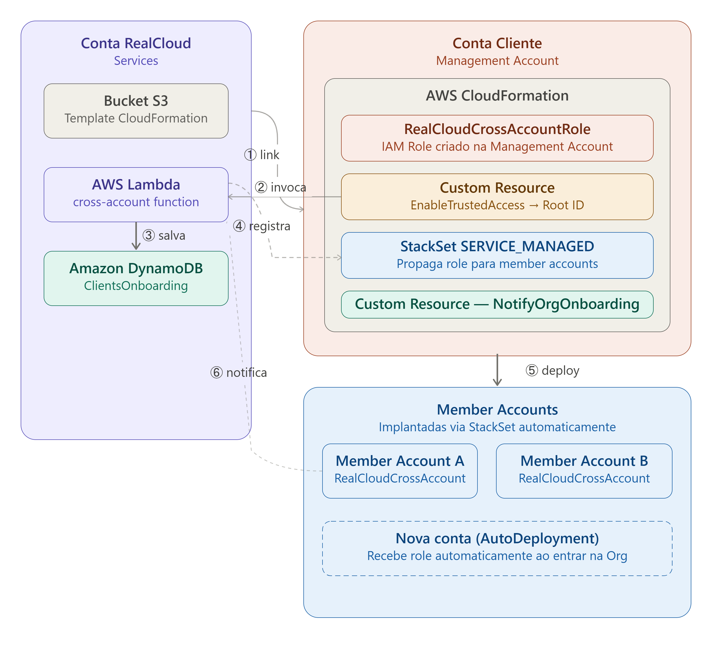

# Cross Account RealCloud - RealGlass Billing

## 1 - Processo de Cross Account: 

 Após a migração do cliente para o serviço de RealGlass Billing, inicia-se a etapa de configuração técnica. Para viabilizar a gestão financeira e aplicar as otimizações contratadas, a RealCloud requer acessos específicos à conta do cliente. Estas permissões são estritamente não invasivas e baseadas no princípio do menor privilégio, garantindo que apenas operações de billing sejam realizadas. A conexão será estabelecida via Cross-Account, conforme detalhado nas seções a seguir.
 
---

### 1.1. Objetivo Cross Account:
 O objetivo desta arquitetura é viabilizar um modelo seguro, automatizado e padronizado de acesso cross-account às informações de billing e cost management das contas AWS dos clientes. A solução permite que a RealCloud acesse os dados de forma segura e controlada, utilizando policies de confiança e Roles IAM, fazendo com que não seja mais necessário o compartilhamento de credenciais e garantindo aderência às melhores práticas de segurança e ao least privilege principle
 
 Adicionalmente, a arquitetura foi concebida para simplificar e escalar o processo de integração de contas, utilizando uma stack do CloudFormation, para assegurar consistência na criação dos recursos necessários, uma função Lambda, para orquestração e uma tabela armazenada no DynamoDB, para registro e rastreabilidade das configurações realizadas. Esse modelo de arquitetura garante governança e auditabilidade, viabilizando análise de custos, geração de insights e otimização financeira de forma eficiente e sustentável.
1.2. Fluxo:

 O fluxo acima descreve como a RealCloud habilita, de forma segura e automatizada, o acesso cross-account às informações de billing a conta do cliente, utilizando serviços nativos AWS. A solução é baseada em CloudFormation, IAM Roles, Lambda, DynamoDB e S3. 
 
### 1.3. Componentes:
Conta RealCloud:
- Amazon S3: Hospeda o template CloudFormation (YAML/JSON) que o cliente executa para realizar o provisionamento.
- AWS Lambda: Atua como Custom Resource do CloudFormation. 
Valida que a conta é a Management Account da Organization — falha imediatamente se for standalone ou member account. 
Habilita o Trusted Access para StackSets via organizations:EnableAWSServiceAccess. 
Resolve o Root ID real da Organization via organizations:ListRoots. 
Registra Management Account e Member Accounts no DynamoDB. 
Processa notificações de exclusão de stacks (offboarding). 
- Amazon DynamoDB: Armazena metadados de todas as contas integradas: Management Account e Member Accounts. 
Campos: account_id, client_name, role_name, external_id, org_id, root_id, member_count, source, cross_account_link, status, updated_at. 

Conta do Cliente:
- AWS CloudFormation: Executa o template fornecido pela RealCloud.
- RealCloudCrossAccountRole: IAM Role criada na Management Account que autoriza o acesso cross-account da RealCloud. 
Inclui permissão organizations:EnableAWSServiceAccess para que a Lambda possa ativar o Trusted Access. 
- Custom Resource EnableTrustedAccess: 
Invoca a Lambda para validar que é Management Account, ativar Trusted Access e resolver o Root ID da Organization. 
Retorna o Root Id como output para o StackSet usar automaticamente. 
- StackSet SERVICE_MANAGED (RealCloud-CrossAccount-MemberAccounts):  
Propaga o RealCloudCrossAccountRole para todas as member accounts da Organization. 
AutoDeployment habilitado: novas contas que entrem na Org recebem o role automaticamente. 
RetainStacksOnAccountRemoval: false — ao sair da Org, o role é removido da member account. 
- Custom Resource NotifyOrgOnboarding:  
Invoca a Lambda ao final do deploy para registrar a Management Account e listar todas as member accounts no DynamoDB. 

Member Accounts (via StackSet):

RealCloudCrossAccountRole: 
Mesma role de acesso, porém sem permissões de organizations:EnableAWSServiceAccess (desnecessárias em member accounts). 
Custom Resource NotifyMemberOnboarding: 
Notifica a Lambda com IsOrgMember: true para registrar a member account no DynamoDB com source: stackset. 

### 1.4. Fluxo de Funcionamento da Arquitetura:
1. EXECUÇÃO DO TEMPLATE: O cliente abre o link do template CloudFormation hospedado no bucket S3 da RealCloud. O CloudFormation inicia o deploy na Management Account. 
2. CRIAÇÃO DO IAM ROLE: O CloudFormation cria o RealCloudCrossAccountRole na Management Account com todas as permissões necessárias, incluindo organizations:EnableAWSServiceAccess. 
3. VALIDAÇÃO E TRUSTED ACCESS (EnableTrustedAccess): A Lambda é invocada via Custom Resource. Ela assume o role, valida que a conta é a Management Account da Organization, habilita o Trusted Access para StackSets e resolve o Root ID real. 
4. CRIAÇÃO DO STACKSET: Com o Trusted Access ativo e o Root ID resolvido, o CloudFormation cria o StackSet SERVICE_MANAGED que propaga o role para todas as member accounts da Organization. 
5. DEPLOY NAS MEMBER ACCOUNTS: O StackSet instala o RealCloudCrossAccountRole em cada member account. Em cada instalação, a Lambda é notificada e registra a member account no DynamoDB com source: stackset. 
6. REGISTRO DA MANAGEMENT ACCOUNT (NotifyOrgOnboarding): Ao final, a Lambda registra a Management Account no DynamoDB com org_id, root_id, member_count e demais metadados. 

## 2 - Políticas de Acesso Cross-Account:

---

Para habilitar a integração cross-account, é criada na conta do cliente a IAM Role RealCloudCrossAccount, que pode ser assumida exclusivamente pela conta de Services da RealCloud por meio do AWS Security Token Service (STS) utilizando AssumeRole.

A role concede acesso somente leitura (read-only) e controlado a serviços relacionados a custos, billing, consumo, otimização, governança, segurança e inventário da infraestrutura, sem permissões de alteração, exclusão ou provisionamento de recursos.

2.1. Faturamento e Custos (Billing & Cost Management):

- account:GetAccountInformation — Informações gerais da conta AWS.
- billing:Get*, billing:List* — Dados de faturamento e contratos.
- budgets:ViewBudget, budgets:Describe* — Orçamentos configurados e status de gastos.
- cur:Get*, cur:Describe* — Cost and Usage Reports (CUR).
- ce:Get*, ce:Describe*, ce:List* — Cost Explorer: análises históricas e previsões de custos.
- invoicing:Get*, invoicing:List* — Faturas emitidas e histórico.
- payments:Get*, payments:List* — Histórico de pagamentos.
- purchase-orders:* — Ordens de compra.
- pricing:DescribeServices — Consulta à tabela oficial de preços da AWS.
- freetier:GetFreeTier* — Monitoramento do Free Tier.
- consolidatedbilling:* — Faturamento consolidado em ambientes AWS Organizations.
- mapcredits:List* — Créditos do programa AWS Migration Acceleration Program (MAP).

### 2.2. Otimização Financeira e Planejamento (FinOps & Savings):

- savingsplans:Describe*, savingsplans:List* — Savings Plans e reservas ativas.
- bcm-pricing-calculator:Get*, bcm-pricing-calculator:List* — Calculadora de preços e projeções financeiras.
- bcm-recommended-actions:List* — Ações recomendadas para otimização de custos.
- cost-optimization-hub:List* — Hub centralizado de recomendações de custo.
- compute-optimizer:Get*, compute-optimizer:Describe*, compute-optimizer:Export* — Recomendações de rightsizing e otimização de recursos.
- trustedadvisor:Describe*, trustedadvisor:List*, trustedadvisor:View* — Recomendações relacionadas a desempenho, disponibilidade e economia.

### 2.3. Infraestrutura, Performance e Utilização:

- ec2:Describe*, autoscaling:Describe* — Instâncias EC2, Auto Scaling Groups e padrões de utilização.
- eks:Describe* — Clusters Kubernetes e workloads.
- lambda:Get*, lambda:List* — Funções Lambda e respectivas configurações.
- s3:Get*, s3:List* — Buckets e configurações de armazenamento.
- rds:Describe* — Bancos de dados Amazon RDS.
- dynamodb:Describe*, dynamodb:List* — Tabelas Amazon DynamoDB.

### 2.4. Monitoramento e Utilização Real (CloudWatch & Logs):

- cloudwatch:Get*, cloudwatch:List* — Métricas operacionais, incluindo CPU, memória, I/O e latência.
- logs:Describe*, logs:Get* — Grupos de logs e configurações de retenção.

### 2.5. Governança, Segurança e Conformidade:

- organizations:Describe*, organizations:List* — Estrutura hierárquica da AWS Organization (Organizational Units e contas).
- organizations:EnableAWSServiceAccess — Habilita o Trusted Access para AWS CloudFormation StackSets (somente na Management Account).
- organizations:DisableAWSServiceAccess, organizations:ListAWSServiceAccessForOrganization — Gerenciamento e consulta do Trusted Access.
- config:Describe*, config:Get* — Recursos auditados e conformidade.
- securityhub:Get*, securityhub:Describe* — Achados de segurança e postura de conformidade.
- inspector2:List*, inspector2:Get* — Vulnerabilidades e exposição de workloads.
- tag:Get* — Tags utilizadas para alocação de custos e categorização por centro de custo.
- servicequotas:Get*, servicequotas:List*, servicequotas:Describe* — Consulta os limites e cotas dos serviços AWS.
- support:Describe* — Casos de suporte ativos.
- servicecatalog:ListApplications — Aplicações registradas no AWS Service Catalog.

## 3 - Como usar:

---
Forneça ao cliente a URL do template CloudFormation hospedado no S3
A URL Executa o onboarding na Management Account e propaga automaticamente o acesso para todas as contas-membro da organização por meio de AWS CloudFormation StackSets.
URL:
https://us-east-1.console.aws.amazon.com/cloudformation/home?region=us-east-1#/stacks/create/review?templateURL=https%3A%2F%2Frealcloudcrossaccount.s3.us-east-2.amazonaws.com%2FRealCloudCrossAccountClient.yml&stackName=RealCloud-CrossAccount-Client&param_ClientName=NOME_DO_CLIENTE

### 3.1. Execução da pilha
 O cliente será direcionado diretamente para a tela do CloudFormation com todos os parâmetros necessários já preenchidos. Será necessário apenas clicar em “Create Stack”.

### 3.2. Após a execução do CloudFormation:
 Assim que a pilha for criada com sucesso na conta do cliente, um processo automático (Custom Resource) enviará os dados para a nossa Conta de Services. A tabela DynamoDB será preenchida automaticamente com as seguintes informações:
 
- account_id: ID numérico da Management Account do cliente.
- client_name: Nome identificador fornecido no parâmetro ClientName.
- role_name: Nome da role criada para acesso cross-account (exemplo: RealCloudCrossAccount).
- external_id: External ID utilizado, caso tenha sido fornecido.
- org_id: Identificador da AWS Organization (exemplo: o-abc123).
- root_id: Root ID da AWS Organization (exemplo: r-ab12), obtido automaticamente.
- member_count: Quantidade de member accounts ativas na AWS Organization.
- cross_account_link: URL para realizar o switch role na Management Account.
- status: Estado atual do registro, definido como active.
- is_management_account: Indica que a conta registrada é a Management Account, com valor true.
  
Os registros das member accounts possuem o campo source, que pode assumir os seguintes valores:
- stackset: indica que a conta foi provisionada por meio do AWS CloudFormation StackSets.
- org_discovery: indica que a conta foi identificada automaticamente durante o processo de descoberta da AWS Organization.
  
### 3.3. Acesso à Conta do Cliente
 Com o registro criado no DynamoDB, você já poderá realizar o "switch role" (salto) para a conta do cliente utilizando o link gerado na coluna cross_account_link.
 
### 3.4. Offboarding
 Se o cliente desejar revogar o acesso, basta ele deletar a Stack no CloudFormation. Esse processo garante segurança total para ambas as partes:

1. Remoção do Role: O RealCloudCrossAccountRole é excluído da Management Account. 
2. Remoção nas Member Accounts: O StackSet remove o role de todas as member accounts automaticamente. 
3. Limpeza do DynamoDB: A Lambda detecta o evento Delete, marca todas as member accounts da Org como org_removed e exclui o registro da Management Account. 

## 4 - Atualizações:

---

 Quando uma nova versão do template estiver disponível no bucket S3 da RealCloud, o processo de atualização é simples: 
Abra o link do template no CloudFormation. 
No CloudFormation, selecione a stack existente e clique em Update. 
Confirme a atualização — o CloudFormation aplicará apenas as mudanças necessárias. 
O IAM Role e as permissões serão ajustados automaticamente, sem impacto na operação. 

O StackSet das member accounts é atualizado automaticamente quando a Management Account recebe a atualização do template.  

## 5 - Logs:

---

 A função Lambda também gera logs no Amazon CloudWatch, na conta de Services da RealCloud, permitindo o acompanhamento da execução e facilitando o troubleshooting em caso de erros ou falhas no processo de integração cross-account.
 Todos os logs dessa automação são gerados automaticamente no Amazon CloudWatch Logs, no seguinte local:
/aws/lambda/cross-account

Nesse Log Group são registrados os principais eventos da execução, incluindo:
Recebimento do evento do CloudFormation

- Execução do acesso cross-account via IAM Role

- Identificação da conta do cliente (Account Alias ou Account ID)

- Criação, atualização ou remoção do registro da integração cross-account

- Envio do status de sucesso ou falha para o CloudFormation

 Cada execução da Lambda gera um Log Stream, que pode ser utilizado para troubleshooting.
 Em caso de falha na integração cross-account, o próprio CloudFormation refere o Log Stream da execução, facilitando a análise.
 Os logs são mantidos na conta de Services e podem ser utilizados para auditoria, rastreabilidade e diagnóstico de problemas, não sendo necessária nenhuma ação por parte do cliente.

## 6 - Dúvidas:

---

### 6.1. O cliente pode remover o acesso quando quiser?
Sim.
 O cliente pode remover o acesso a qualquer momento, bastando excluir a stack do   CloudFormation ou a IAM Role RealCloudCrossAccount criada para a integração.
 Após a remoção, a RealCloud perde imediatamente o acesso à conta do cliente.

### 6.2. Há impacto em custos?
Não.
 A criação da IAM Role e das políticas não gera custo adicional para o cliente.
 O acesso é somente para leitura e análise de dados já existentes na conta.

### 6.3. A RealCloud consegue criar, alterar ou excluir recursos?
Não.
 A role possui permissões restritas, focadas apenas em billing, custos, consumo e otimização, sem permitir ações de criação, modificação ou exclusão de recursos.

### 6.4. A RealCloud tem acesso a dados de aplicações?
Não.
 A integração não concede acesso a dados de aplicação, bancos de dados, código ou informações sensíveis.
 O escopo é limitado a metadados e informações financeiras.

### 6.5. O acesso é monitorado?
Sim.
 Todas as ações realizadas via cross-account podem ser auditadas pelo cliente através do AWS CloudTrail, garantindo total transparência.

### 6.6. O acesso é permanente?
Não.
 O acesso permanece ativo apenas enquanto a role existir na conta do cliente.
 Caso a role seja removida ou a stack excluída, o acesso é automaticamente revogado.

### 6.7. O que acontece se a conta estiver em AWS Organizations?
A role funciona normalmente tanto em contas standalone quanto em contas membros de uma Organization.
 As permissões concedidas respeitam as políticas da Organization (SCPs) existentes.

### 6.8. É possível limitar ainda mais as permissões?
Sim.
 Caso o cliente tenha alguma restrição específica, as permissões podem ser avaliadas e ajustadas, desde que não comprometam as funcionalidades necessárias para análise de custos e otimização.

### 6.9. A RealCloud acessa a conta o tempo todo?
Apenas sob demanda.
 O acesso é realizado via Cross-Account Role sempre que for necessário coletar dados atualizados (ex: relatórios de billing, métricas de consumo, etc.). 

## 7 - Conclusão:
 A integração Cross Account RealCloud – RealGlass Billing foi projetada para oferecer um modelo seguro, automatizado e transparente de acesso às informações de billing e cost management das contas AWS dos clientes.
 Por meio do uso de serviços nativos da AWS, a solução garante controle total ao cliente, aderência ao princípio do menor privilégio, auditabilidade e facilidade de operação, permitindo que a RealCloud realize análises financeiras, gere insights e proponha otimizações sem impactar a operação ou a segurança do ambiente do cliente.
